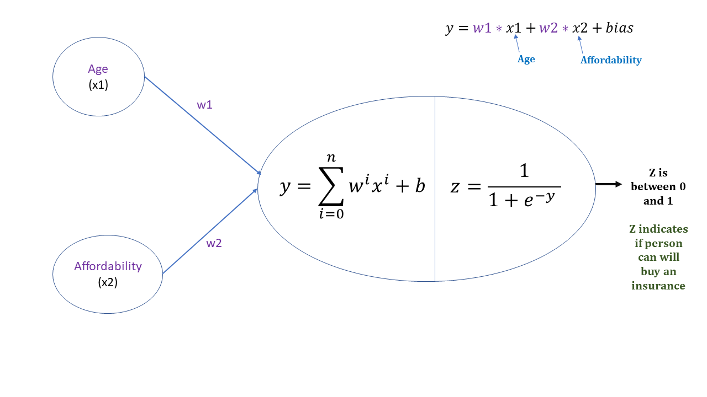

# MyNN : Réseau de Neurones Simple pour la Classification Binaire

## Description

Ce dépôt contient une implémentation simple d'un réseau de neurones en Python en utilisant NumPy, développée à partir de zéro. Le modèle est une régression logistique de base avec deux entrées et une sortie, utilisant une fonction d'activation sigmoïde. L'objectif est d'illustrer comment la descente de gradient peut être implémentée à partir de zéro pour minimiser la perte logarithmique dans une tâche de classification binaire.


### Aperçu du Modèle



- Le modèle possède **2 caractéristiques en entrée** et **1 sortie**.

- La prédiction finale est passée par une **fonction d'activation sigmoïde** pour produire une valeur entre 0 et 1.

- Le modèle utilise la **descente de gradient** pour mettre à jour les poids (`w1`, `w2`) et le biais (`b`), avec un **taux d'apprentissage** de `0,1`.

## Fichiers

- `myNN.ipynb` : Le fichier Jupyter Notebook principal contenant l'implémentation du réseau de neurones, la logique d'entraînement et un exemple d'utilisation.
- `insurance_data.csv` : Le jeu de données utilisé pour l'entraînement et le test du modèle. Il contient des données d'assurance synthétiques avec deux caractéristiques.
- `README.md` : Ce fichier, qui explique la structure du projet et fournit des instructions pour exécuter le code.

## Prérequis

Pour exécuter ce notebook, vous devez avoir les bibliothèques suivantes installées :

- `numpy`
- `pandas`
- `sklearn`
- `random`

Vous pouvez installer ces bibliothèques en exécutant :

```bash
pip install numpy pandas scikit-learn
```

## Utilisation

1. **Cloner le Dépôt**

   ```bash
   git clone <repo-url>
   cd <repo-directory>
   ```

2. **Exécuter le Notebook**

   Vous pouvez ouvrir et exécuter le Jupyter notebook dans votre environnement local :

   ```bash
   jupyter notebook myNN.ipynb
   ```

3. **Entraîner le Modèle**

   Le notebook fournit une implémentation d'un réseau de neurones simple. Après avoir chargé le notebook, vous pouvez instancier le modèle et l'entraîner en utilisant la méthode `fit` :

   ```python
   model = myNN()
   model.fit(X_train, y_train, epochs=1000)
   ```

   Le modèle affichera des informations sur les poids, le biais et la perte à intervalles réguliers pendant l'entraînement.

4. **Faire des Prédictions**

   Une fois le modèle entraîné, vous pouvez utiliser la méthode `predict` pour obtenir des prédictions sur vos données d'entrée :

   ```python
   y_pred = model.predict(X_test)
   ```

## Notes Importantes

- Le jeu de données `X_train` et `y_train` doit être préparé au préalable. Assurez-vous que `X_train` est un tableau NumPy avec deux colonnes (caractéristiques) et que `y_train` est une variable cible binaire.
- Le modèle est conçu pour arrêter l'entraînement de manière anticipée si le changement de perte est inférieur à un seuil (`StopLoss`). Il s'agit d'une implémentation basique pour démontrer le concept d'**arrêt anticipé**.

## Exemple de Résultat

- Le modèle affichera la perte à chaque epoch et montrera les poids et le biais mis à jour pendant l'entraînement.

  Exemple de sortie après l'entraînement :
  ```
  epoch: 0, w1: 0.9979, w2: 0.9914, bias: -0.0158, Loss: 0.6459
  epoch: 50, w1: 1.0416, w2: 0.8203, bias: -0.4546, Loss: 0.5903
  ```

##

## Contribution

Si vous avez des questions concernant ce notebook, des améliorations ou des suggestions, vous pouvez m'envoyer un mail : [chouaibconcours13@gmail.com](mailto\:chouaibconcours13@gmail.com)

##
